# Hugo to Next.js Migration Plan

## Project Overview
Migrate throw.nullreference.io from Hugo to Next.js with modern React components, preserving all content and URLs while improving developer experience.

## Tech Stack
- **Framework**: Next.js 14+ (App Router)
- **Content**: MDX with ContentLayer
- **Styling**: Tailwind CSS + shadcn/ui components
- **Diagrams**: Mermaid (replacing PlantUML)
- **Deployment**: DigitalOcean App Platform (Static Site)
- **Package Manager**: npm (matching current setup)

## Migration Strategy

### Phase 1: Project Setup
1. Initialize Next.js with TypeScript
   ```bash
   npx create-next-app@latest . --typescript --tailwind --app --use-npm
   ```

2. Install dependencies:
   ```json
   {
     "dependencies": {
       "next": "^14.0.0",
       "react": "^18.0.0",
       "react-dom": "^18.0.0",
       "contentlayer": "^0.3.4",
       "next-contentlayer": "^0.3.4",
       "mermaid": "^10.6.0",
       "reading-time": "^1.5.0",
       "gray-matter": "^4.0.3",
       "remark": "^15.0.0",
       "remark-html": "^16.0.0",
       "rehype-highlight": "^7.0.0",
       "rehype-slug": "^6.0.0",
       "rehype-autolink-headings": "^7.0.0"
     }
   }
   ```

3. Configure ContentLayer (contentlayer.config.ts)
4. Setup Tailwind CSS with custom theme
5. Initialize shadcn/ui components

### Phase 2: URL Structure & Redirects

#### Current Hugo URLs → New Next.js URLs
```
/posts/[slug]/                    → /blog/[slug]
/docs/Learning-Go/[...path]       → /learn/go/[...path]
/categories/                      → /topics
/tags/                           → /topics
/series/                         → /topics
/archives/                       → /archive
/search/                         → /search
/offline/                        → /offline
```

#### Redirect Configuration (next.config.js)
```javascript
module.exports = {
  async redirects() {
    return [
      // Posts redirects
      {
        source: '/posts/:slug*',
        destination: '/blog/:slug*',
        permanent: true,
      },
      // Docs redirects
      {
        source: '/docs/Learning-Go/:path*',
        destination: '/learn/go/:path*',
        permanent: true,
      },
      // Taxonomy redirects
      {
        source: '/categories/:slug*',
        destination: '/topics/:slug*',
        permanent: true,
      },
      {
        source: '/tags/:slug*',
        destination: '/topics/:slug*',
        permanent: true,
      },
      {
        source: '/series/:slug*',
        destination: '/topics/:slug*',
        permanent: true,
      },
    ]
  },
}
```

### Phase 3: Component Library

#### Shortcode → React Component Mapping

1. **Figure** (Hugo built-in → Next.js Image)
   ```jsx
   // components/Figure.tsx
   import Image from 'next/image'
   
   export function Figure({ src, alt, caption, width, height }) {
     return (
       <figure>
         <Image src={src} alt={alt} width={width} height={height} />
         {caption && <figcaption>{caption}</figcaption>}
       </figure>
     )
   }
   ```

2. **Alert** (svg-alert → Alert component)
   ```jsx
   // components/Alert.tsx
   export function Alert({ type, icon, children }) {
     return (
       <div className={`alert alert-${type}`}>
         <Icon name={icon} />
         <div>{children}</div>
       </div>
     )
   }
   ```

3. **YouTube** (youtube → YouTube component)
   ```jsx
   // components/YouTube.tsx
   export function YouTube({ id, title }) {
     return (
       <iframe
         src={`https://www.youtube.com/embed/${id}`}
         title={title}
         allowFullScreen
       />
     )
   }
   ```

4. **MermaidDiagram** (PlantUML replacement)
   ```jsx
   // components/MermaidDiagram.tsx
   'use client'
   import { useEffect, useRef } from 'react'
   import mermaid from 'mermaid'
   
   export function MermaidDiagram({ chart }) {
     const ref = useRef(null)
     
     useEffect(() => {
       mermaid.initialize({ startOnLoad: true })
       mermaid.contentLoaded()
     }, [])
     
     return <div ref={ref} className="mermaid">{chart}</div>
   }
   ```

### Phase 4: Content Migration

#### Content Structure
```
content/
├── blog/           (from posts/)
│   ├── hello-world.mdx
│   ├── learning-go.mdx
│   └── ...
├── learn/          (from docs/)
│   └── go/
│       ├── index.mdx
│       ├── scheduler.mdx
│       └── experiments/
│           ├── index.mdx
│           └── extension-methods.mdx
└── pages/          (standalone pages)
    ├── about.mdx
    ├── archive.mdx
    └── offline.mdx
```

#### Migration Process for Each File
1. Copy content to new location
2. Update frontmatter for ContentLayer
3. Replace Hugo shortcodes with React components
4. Convert PlantUML to Mermaid
5. Update internal links
6. Delete original Hugo file

#### Example Content Migration
```mdx
---
title: "Hello World"
date: 2021-12-10T21:35:43-05:00
draft: false
thumbnail: "./images/helloworld-2.png"
---

import { Figure } from '@/components/Figure'

<Figure 
  src="/images/helloworld-2.png" 
  width={300} 
  height={300} 
  alt="The words 'Hello World' in neon green on a black background." 
/>

[Scott Hanselman](https://twitter.com/shanselman) wrote a post...
```

### Phase 5: PlantUML to Mermaid Conversion

#### Example: Logical Deployment Diagram

```mermaid
graph TB
    subgraph "WebScheduler.Server"
        OrleansSilo["🟣 Orleans Silo"]
        OrleansDashboard[Orleans Dashboard]
        OrleansHealthChecks[Health Checks]
        
        OrleansDashboard --> OrleansSilo
        OrleansHealthChecks --> OrleansSilo
    end
    
    subgraph "WebScheduler.FrontEnd.BlazorApp"
        BlazorApp["⚡ Blazor WebAssembly"]
    end
    
    subgraph "WebScheduler.Api"
        WebApiHost[Web API Host]
        WebApiHealthChecks[Health Checks]
        
        WebApiHealthChecks --> WebApiHost
    end
    
    WebApiHost --> OrleansSilo
    BlazorApp --> WebApiHost
    
    click OrleansSilo "https://github.com/web-scheduler/web-scheduler/tree/main/Source/WebScheduler.Server"
```


### Phase 6: DigitalOcean Deployment

#### .do/app.yaml Configuration
```yaml
name: throw-nullreference-io
region: nyc
services:
  - name: web
    type: static
    environment_slug: node-js
    build_command: npm run build
    source_dir: /
    output_dir: out
    catchall_document: 404.html
    cors:
      allow_origins:
        - prefix: https://throw.nullreference.io
    routes:
      - path: /
    envs:
      - key: NODE_ENV
        value: production
      - key: NEXT_PUBLIC_SITE_URL
        value: https://throw.nullreference.io
domains:
  - domain: throw.nullreference.io
    type: PRIMARY
```

#### Build Configuration (package.json)
```json
{
  "scripts": {
    "dev": "next dev",
    "build": "next build && next export -o out",
    "start": "next start",
    "lint": "next lint",
    "typecheck": "tsc --noEmit"
  }
}
```

### Phase 7: Features Implementation

1. **Search**: Client-side search with Fuse.js
2. **RSS Feed**: Generate at build time
3. **Sitemap**: Auto-generate with next-sitemap
4. **Dark Mode**: System preference + toggle
5. **Reading Time**: Calculate and display
6. **Table of Contents**: Auto-generate from headings
7. **Syntax Highlighting**: Shiki or Prism.js

### Phase 8: Cleanup & Optimization

1. Delete all Hugo-specific files:
   - `config.toml` and `config/` directory
   - `themes/` directory
   - `layouts/` directory
   - `archetypes/` directory
   - `hugo_stats.json`
   - Old `.md` files after migration

2. Update repository:
   - New README.md with Next.js instructions
   - Update .gitignore for Next.js
   - Remove Hugo GitHub Actions
   - Add Next.js deployment workflow

3. Performance optimizations:
   - Image optimization with next/image
   - Font optimization
   - Bundle size analysis
   - Lighthouse testing

## Migration Checklist

- [ ] Create Next.js project structure
- [ ] Install and configure dependencies
- [ ] Create .do/app.yaml
- [ ] Build React component library
- [ ] Setup ContentLayer with MDX
- [ ] Configure URL redirects
- [ ] Migrate blog posts (delete old files)
- [ ] Migrate documentation (delete old files)
- [ ] Convert PlantUML diagrams to Mermaid
- [ ] Implement search functionality
- [ ] Add RSS feed generation
- [ ] Setup dark mode
- [ ] Configure DigitalOcean deployment
- [ ] Test all redirects
- [ ] Delete all Hugo files
- [ ] Deploy to production

## Success Criteria

1. All existing URLs redirect properly (301)
2. All content preserved and accessible
3. Improved page load performance
4. Modern development experience
5. Successful deployment on DigitalOcean
6. No broken links or images
7. SEO rankings maintained

## Rollback Plan

1. Keep Hugo branch until migration verified
2. Test deployment on staging URL first
3. Monitor 404 errors post-deployment
4. Have redirect map ready for fixes

## Timeline

- **Day 1-2**: Setup and component development
- **Day 3-4**: Content migration
- **Day 5**: Features and testing
- **Day 6**: Deployment and verification

## Notes

- All image paths need updating for Next.js public directory
- Internal links need validation during migration
- Consider implementing incremental static regeneration (ISR) for dynamic content
- Monitor Core Web Vitals after deployment